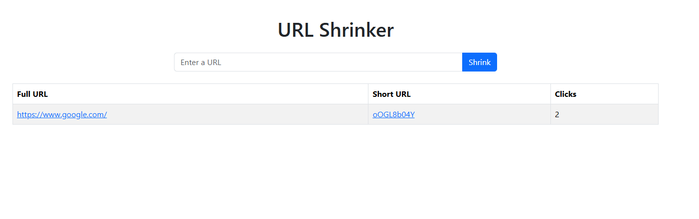

# URL Shortener

A simple URL shortener application built using Node.js, Express, and MongoDB. This app allows users to shorten long URLs and access them via a short alias. It tracks the number of clicks for each short URL.



## Features

- Shorten long URLs and store them in a MongoDB database.
- Redirect to the original URL when accessing the short URL.
- Track the number of clicks for each shortened URL.

## Tech Stack

- **Node.js**: JavaScript runtime for building the server-side application.
- **Express**: Web framework for Node.js to handle routing and middleware.
- **MongoDB**: NoSQL database to store the original URLs and their shortened versions.
- **Mongoose**: ODM (Object Data Modeling) library to interact with MongoDB.
- **shortid**: A package used to generate short, unique IDs for the shortened URLs.
- **EJS**: Templating engine to render views on the frontend.

## Installation

### Prerequisites

- [Node.js](https://nodejs.org/) (v12 or higher)
- [MongoDB](https://www.mongodb.com/) (local or cloud instance)

### Steps to Set Up

1. Clone the repository:

   ```bash
   git clone https://github.com/yourusername/url_shortener.git
   cd url_shortener
   ```

2. Install dependencies:

   ```bash
   npm i
   ```

3. Set up MongoDB locally or use a cloud-based service like MongoDB Atlas.

4. Start the development server:

   ```bash
   npm run dev
   ```

   This will run the application using nodemon, which automatically reloads the server on code changes.

5. Open your browser and visit http://localhost:5000 to start using the URL shortener.

### Endpoints

GET /: Displays a list of all shortened URLs and the option to create a new one.
POST /shortURLs: Accepts a full URL to shorten and stores it in the database.
GET /:shortUrl: Redirects to the original URL when the short URL is accessed.

### Example

Go to the home page and submit a URL to shorten.
After submission, you will receive a short URL (e.g., http://localhost:5000/oOGL8b04Y).
Access the short URL to be redirected to the original URL.
Each time the short URL is accessed, the click count is updated in the database.
